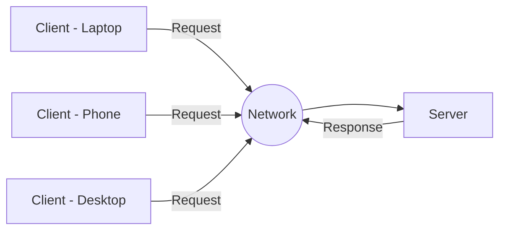
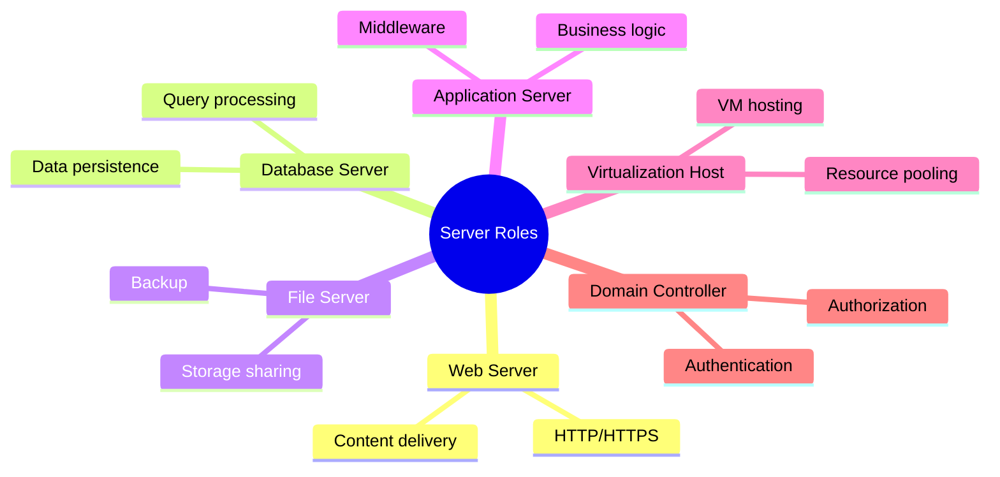
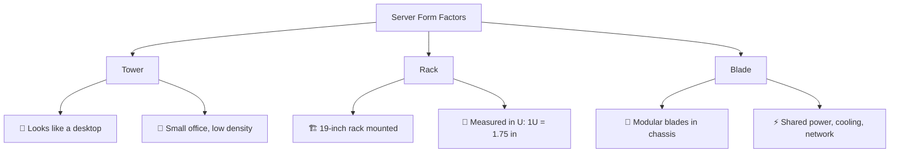
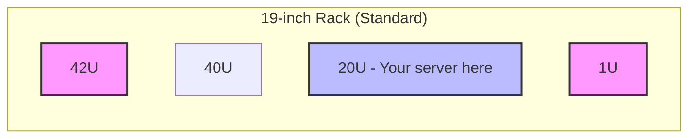
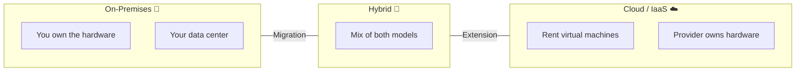
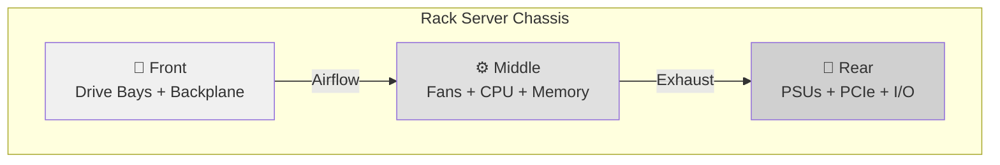
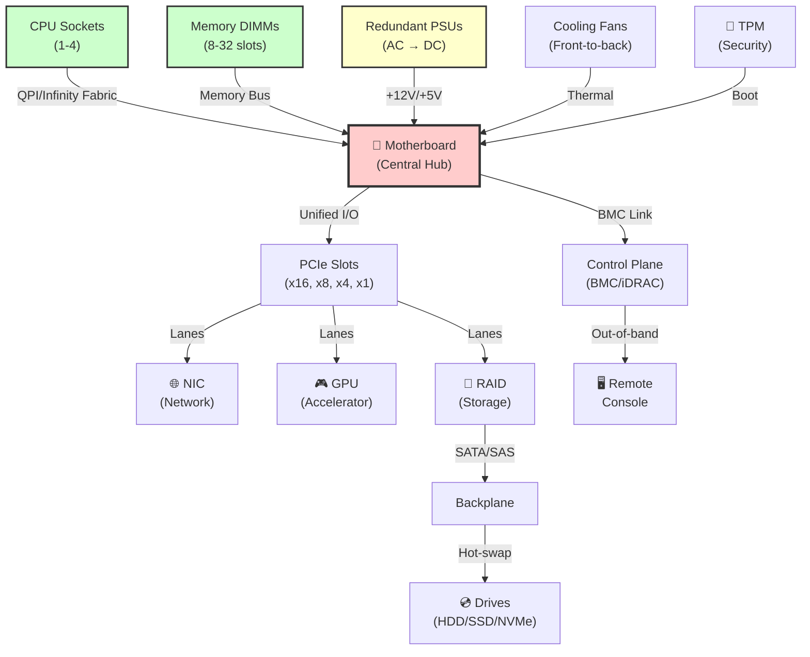
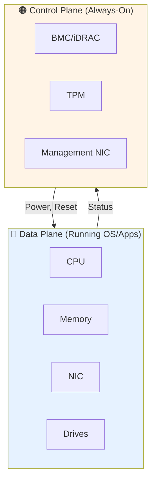

# 🖥️ Day 1 — Server Basics

<div align="center">

| | |
|---|---|
| **Module Level** | 🟢 Beginner |
| **Track** | Server Hardware Training |
| **Duration** | ~2 hours |
| **Prerequisites** | None |

</div>

---

## 📋 Learning Objectives

By the end of this module, you will be able to:

- ✅ Explain what a server is and how it differs from a desktop
- ✅ Identify tower, rack, and blade servers and their use cases
- ✅ Recognize major internal hardware components on sight
- ✅ Distinguish the data plane from the control plane (BMC)
- ✅ Understand how cloud VMs map to physical hardware

---

## 🗂️ At a Glance

| Topic | Focus | Time |
|---|---|---|
| **1.1** | What Is a Server | Concept & roles | 20 min |
| **1.2** | Server Form Factors | Tower / Rack / Blade | 30 min |
| **1.3** | On-Prem vs Cloud | Where hardware lives | 20 min |
| **1.4** | Internal Components | Tour of hardware | 40 min |

---

## 1.1 — What Is a Server?

### Definition

A **server** is a computer dedicated to providing services (compute, storage, applications) to other machines called **clients**, usually over a network.

> **Key difference:** Unlike a desktop built for a single interactive user, servers are engineered for **24x7 uptime, redundancy, remote management, and high I/O**.

### The Client-Server Model



### Server vs Desktop Comparison

| Attribute | Desktop | Server |
|---|---|---|
| **Uptime** | Working hours | 24/7 |
| **Users** | Single | Many (clients) |
| **Memory** | Standard | ECC (error-correcting) |
| **Power Supply** | Single | Often redundant (N+1) |
| **Management** | Local | Remote / out-of-band |
| **Thermal** | Passive cooling | Active airflow management |
| **Cost** | Lower | Higher (reliability focused) |

### Common Server Roles



<details>
<summary><b>📸 Visual Reference</b></summary>

**Image:** `assets/server-hardware/day1-datacenter.jpg`  
A photo of a real data center with multiple rack servers installed in a row.

</details>

---

## 1.2 — Server Form Factors

Server form factors represent different physical designs, each trading off **density, scalability, cost, and cooling requirements**.

### Overview



### Detailed Comparison

| Form Factor | Density | Scalability | Upfront Cost | Operational Cost | Best For |
|---|---|---|---|---|---|
| **Tower** | 🔴 Low | 🔴 Low | 💚 Low | 💚 Low | Small office, single server, testing |
| **Rack** | 🟡 Medium-High | 🟢 High | 🟡 Medium | 🟡 Medium | Enterprise data centers, standard deployments |
| **Blade** | 🟢 Very High | 🟢 Very High | 🔴 High | 💚 Low | High-density compute, HPC clusters |

### Understanding Rack Units (U)

A standard server rack is **19 inches** wide and measured vertically in **U**, where:

> **1U = 1.75 inches (44.45 mm)**

**Common heights:**
- **1U** = 1.75 in (single processor, thin)
- **2U** = 3.5 in (dual processor, more drives)
- **4U** = 7 in (specialized, GPU-heavy)
- **42U** = Standard rack height



<details>
<summary><b>📸 Visual Reference</b></summary>

**Image:** `assets/server-hardware/day1-formfactors.png`  
Side-by-side comparison photos of tower, rack, and blade servers.

</details>

---

## 1.3 — On-Premises vs Cloud Hardware View

Even in cloud-first teams, the same physical hardware concepts exist underneath the abstraction layer.

### The Three Models



### Responsibility Matrix

| Model | Hardware Owner | You Manage | Hardware Literacy | Example |
|---|---|---|---|---|
| **On-Premises** | You | Everything | ✅ Essential | Private data center |
| **Cloud (IaaS)** | Provider | OS, apps, data | ✅ Still important | AWS EC2, Azure VMs |
| **Cloud (PaaS)** | Provider | Apps, data | 🟡 Helpful | AWS Lambda, Azure Functions |
| **Cloud (SaaS)** | Provider | Data only | 🔵 Not required | Microsoft 365, Salesforce |

### The Critical Insight

A cloud VM specification like:
```
8 vCPU | 32 GB RAM | 500 GB SSD
```

**Maps directly to:**
- 8 physical CPU cores (or hyperthreads)
- 32 GB of DRAM memory
- 500 GB of solid-state storage

> **Takeaway:** Understanding physical hardware is essential even for cloud-native engineers. The abstraction hides complexity but doesn't eliminate it.

---

## 1.4 — Inside the Server: Hardware Components

### Internal Layout (Front to Back)



### Component Reference Table

| Component | What It Is | Why It Matters | Failure Impact |
|---|---|---|---|
| **CPU (Processor)** | The "brain" executing instructions; Xeon/EPYC support many cores & multiple sockets | Drives compute power; cores = parallel workload capacity | 🔴 System down |
| **Memory (RAM/DIMMs)** | Fast temporary storage in DIMM slots; servers use ECC | Holds active data & OS; too little → memory paging/slowness | 🔴 System crash |
| **Motherboard** | Central board connecting all components via buses | Defines socket count, slot count, and expansion limits | 🔴 Complete failure |
| **Control Plane (BMC)** | Always-on micro-controller (iDRAC/iLO/IPMI) independent of OS | Enables remote power, console, & health monitoring even when OS is down | 🟠 Lost remote access |
| **Hard Disk/Drives** | Persistent storage media (HDD, SSD, NVMe) in hot-swap bays | Where OS and data live; type affects speed (IOPS/latency) | 🔴 Data loss |
| **Backplane** | Board behind drive bays connecting all drives to controller | Enables hot-swap capability without individual cables | 🟠 No hot-swap |
| **RAID Controller** | Card managing drives, RAID arrays, and cache | Provides redundancy (RAID 1/5/6) and performance boost | 🟠 Degraded performance |
| **PCIe Slots** | Expansion lanes for add-in cards (16x, 8x, 4x, 1x) | Enables NICs, GPUs, RAID, NVMe, and accelerators | 🟡 Limited expansion |
| **Riser Card** | Board allowing PCIe cards to mount horizontally | Allows full-size cards in low-profile/blade chassis | 🟡 Layout constraint |
| **NIC** | Network Interface (1/10/25/100 GbE), onboard or add-in | Connects server to network; speed impacts workload | 🟠 Network isolation |
| **GPU/Accelerator** | High-throughput cards for AI, ML, rendering, HPC | Massive parallel compute; 10-100x CPU for specific workloads | 🟠 Reduced throughput |
| **VGA/Video Output** | Basic onboard graphics via BMC for console access | Local crash cart debugging and BIOS setup | 🟡 Requires remote console |
| **Power Supplies (PSU)** | Redundant units (1+1 or 2+1) converting AC to DC | Provides N+1 redundancy; one can fail without downtime | 🟠 Single point of failure |
| **Cooling Fans** | High-RPM fans pushing front-to-back airflow | Prevents thermal throttling and component damage | 🔴 Thermal shutdown |
| **TPM Module** | Hardware security chip for cryptographic keys | Root of trust for platform security and secure boot | 🟡 Reduced security |

### How the Pieces Connect



### Data Plane vs Control Plane

#### 🔵 Data Plane (The Workload Path)
- **Components:** CPU, Memory, Drives, NICs, GPUs
- **Purpose:** Execute actual work (applications, queries, compute)
- **Dependency:** OS must be running and healthy
- **Performance:** Directly impacts user workloads

#### 🟠 Control Plane (The Management Path)
- **Components:** BMC (iDRAC/iLO/IPMI), TPM, Management NIC
- **Purpose:** Monitor, control, and recover the server
- **Dependency:** Independent from OS; works even when powered off
- **Operations:** Power cycles, serial console, health monitoring, firmware updates



<details>
<summary><b>📸 Visual Reference</b></summary>

**Image:** `assets/server-hardware/day1-internal-layout.png`  
Top-down photo of an open 2U server with all major components labeled (CPU, DIMMs, PCIe risers, backplane, PSUs, fans).

</details>

---

## 📚 Summary & Outcomes

### Key Takeaways

✅ **A server** is purpose-built for uptime, reliability, and remote management—not interactive use  
✅ **Three form factors** serve different needs: tower (small), rack (standard enterprise), blade (high-density)  
✅ **Rack units (U)** measure height; 1U = 1.75 inches; standard racks are 42U tall  
✅ **Hardware concepts apply everywhere**: on-prem, cloud, and hybrid—cloud VMs map directly to physical CPU/RAM/storage  
✅ **Internal components** are organized for serviceability: drives front, cooling middle, power/I/O rear  
✅ **Data plane** (CPU/memory/drives) runs workloads; **control plane** (BMC) manages independently  

### What You Can Now Do

By completing this module, you can:

- [ ] Explain the difference between a server and a desktop (5+ differences)
- [ ] Identify whether a given deployment scenario suits tower, rack, or blade form factors
- [ ] Recognize major hardware components in a server photo and describe their function
- [ ] Explain how a cloud VM specification maps to physical hardware resources
- [ ] Describe the data plane vs control plane and why they're separate

---

## ✏️ Quick Quiz

<details>
<summary><b>Click to reveal quiz questions</b></summary>

1. **What is the main difference between a server and a desktop?**
   - _Servers are built for 24x7 uptime, remote management, and serving multiple clients; desktops are for single interactive users._

2. **How many inches is 1U?**
   - _1.75 inches (44.45 mm)_

3. **What does the backplane connect, and why does it enable hot-swap?**
   - _The backplane connects all drive bays to the storage controller without individual cables. Hot-swap works because the backplane provides a standardized electrical interface so you can insert/remove drives without shutting down._

4. **What is the control plane (BMC) and why can it work when the OS is off?**
   - _The BMC is a separate, always-on micro-controller (iDRAC, iLO, IPMI) that operates independently of the main OS. It has its own firmware, network interface, and power path so it can manage the server even during power-off._

5. **Name two types of cards that plug into PCIe slots.**
   - _Network Interface Cards (NICs), GPUs, RAID controllers, NVMe adapters, encryption accelerators, etc._

6. **Why is ECC memory used in servers?**
   - _ECC (Error-Correcting Code) detects and corrects single-bit memory errors that can occur due to cosmic rays or manufacturing flaws. This prevents silent data corruption in long-running workloads._

</details>

---

## 🎨 How to Add Photos

This document uses **Mermaid diagrams** that render automatically in GitHub and VS Code (with the [Markdown Preview Mermaid extension](https://marketplace.visualstudio.com/items?itemName=bierner.markdown-mermaid)).

### Adding Real Photos

1. Create an `assets/server-hardware/` folder in the repository root
2. Place images there (JPG, PNG)
3. Images will auto-render where the `<details>` blocks say "Image: assets/..."

### Recommended Images

| Image | Purpose | Source Suggestion |
|---|---|---|
| `day1-datacenter.jpg` | Show a real data center with multiple rack servers | Photos from Azure/AWS documentation, or public data center images |
| `day1-formfactors.png` | Tower vs Rack vs Blade comparison | Side-by-side photos from Dell/HP/Lenovo datasheets |
| `day1-internal-layout.png` | Open server with labeled components | Data center photos showing internals or server spec sheets |

---

## 🔗 Navigation

| Previous | Current | Next |
|---|---|---|
| — | **Day 1: Server Basics** | [Day 2: Core Components →](./Day-2.md) |

---

## 📝 References & Resources

- [Intel Xeon Processor Families](https://www.intel.com/content/www/us/en/products/details/processors/xeon/)
- [AMD EPYC Processor Series](https://www.amd.com/en/products/specifications/processors/epyc)
- [IPMI Standard (Intelligent Platform Management Interface)](https://www.intel.com/content/www/us/en/products/details/tools/ipmi.html)
- [PCI Express Specification](https://pcisig.com/)
- [Server Form Factors (TIA-942 Data Center Standards)](https://www.ansi.org/)

---

<div align="center">

**Last Updated:** 2026-06-17  
**Status:** 🟢 Published  
**Feedback:** Open an issue or PR to suggest improvements

</div>
