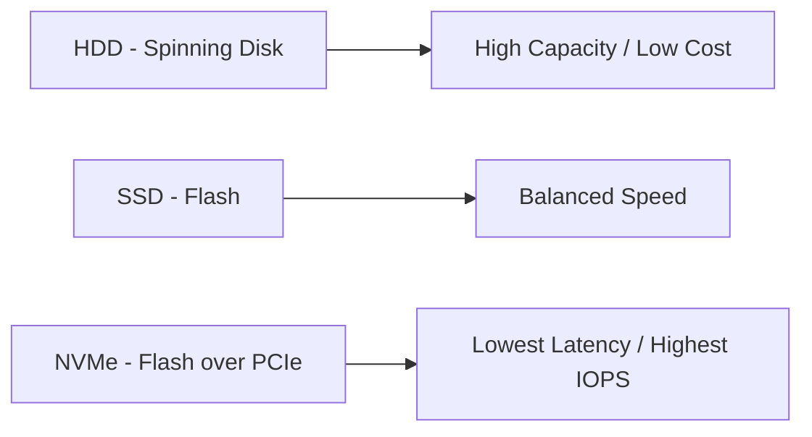
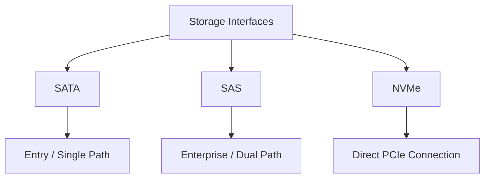
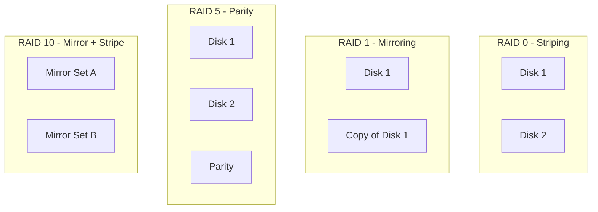
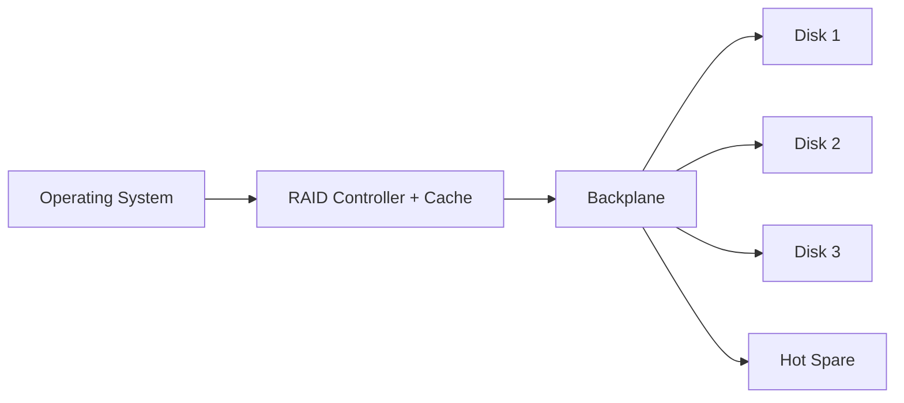

# Day 3 — Storage & RAID

  
  
  

  <b>Goal:</b> Understand storage media types, how they connect, and how RAID delivers performance and redundancy.

---

## Topics in This Module

1. [Storage Media Types](#31--storage-media-types)
2. [Storage Interfaces Deep Dive](#32--storage-interfaces-deep-dive)
3. [RAID Levels](#33--raid-levels)
4. [Controllers, Hot Spare & Hot Swap](#34--controllers-hot-spare--hot-swap)

---

# 3.1 — Storage Media Types

Servers choose storage by balancing:

* Cost
* Capacity
* Speed
* Endurance

| Media              |   Speed   | Cost / GB | Best For                           | Failure Risk    |
| ------------------ | :-------: | :-------: | ---------------------------------- | --------------- |
| **HDD**            |    Low    |   Lowest  | Bulk storage, backups              | Mechanical wear |
| **SSD (SATA/SAS)** |    High   |   Medium  | General-purpose workloads          | Flash wear      |
| **NVMe**           | Very High |   Higher  | Databases, caching, virtualization | Flash wear      |

> [!NOTE]
> **Endurance** is measured in **DWPD (Drive Writes Per Day)**. Write-intensive workloads require higher DWPD ratings.

---

# 3.2 — Storage Interfaces Deep Dive

The storage interface determines how a drive connects and communicates with the server.

| Interface | Tier        |  Paths | Notes                                  |
| --------- | ----------- | :----: | -------------------------------------- |
| **SATA**  | Entry       | Single | Lower throughput and cost              |
| **SAS**   | Enterprise  |  Dual  | Higher reliability and queue depth     |
| **NVMe**  | Performance |  PCIe  | Lowest latency and highest performance |

> [!TIP]
> SAS dual-path connectivity allows the drive to remain accessible even if one controller path fails.

---

# 3.3 — RAID Levels

**RAID (Redundant Array of Independent Disks)** combines multiple drives to provide:

* Performance
* Redundancy
* Fault tolerance

## Visual Overview

## RAID Comparison

|  RAID  | Technique         | Min Disks |  Fault Tolerance  | Usable Capacity | Best For                      |
| :----: | ----------------- | :-------: | :---------------: | :-------------: | ----------------------------- |
|  **0** | Striping          |     2     |        None       |       100%      | Temporary data, scratch disks |
|  **1** | Mirroring         |     2     |       1 disk      |       50%       | OS drives, critical data      |
|  **5** | Striping + Parity |     3     |       1 disk      |     (n−1)/n     | Balanced protection           |
|  **6** | Double Parity     |     4     |      2 disks      |     (n−2)/n     | Large drive arrays            |
| **10** | Mirror + Stripe   |     4     | 1 per mirror pair |       50%       | Databases and virtualization  |

> [!WARNING]
> RAID 0 provides no fault tolerance. A single disk failure destroys the entire array.

> [!IMPORTANT]
> RAID is not a backup. RAID protects against disk failures, not accidental deletion, corruption, ransomware, or site disasters.

---

# 3.4 — Controllers, Hot Spare & Hot Swap

## Hardware vs Software RAID

| Aspect           | Hardware RAID        | Software RAID    |
| ---------------- | -------------------- | ---------------- |
| Processing       | Dedicated controller | Operating system |
| Performance      | Cache-assisted       | CPU dependent    |
| Cost             | Higher               | Lower            |
| Cache Protection | Battery/Flash cache  | OS dependent     |

## Key Operational Concepts

* **Hot Swap** — Replace a failed drive without shutting down the server.
* **Hot Spare** — Standby drive that automatically rebuilds the array.
* **BBWC / FBWC** — Battery-backed or flash-backed write cache protecting cached data.

> [!TIP]
> Combining RAID, hot spares, and hot-swap drive bays enables storage maintenance with little or no downtime.

---

# Day 3 Summary

* **HDD** provides capacity and low cost.
* **SSD** balances performance and price.
* **NVMe** delivers the lowest latency and highest IOPS.
* **SATA** is entry-level storage.
* **SAS** offers enterprise reliability.
* **NVMe** provides direct PCIe performance.
* **RAID** improves performance and redundancy.
* RAID is never a replacement for backups.

---

## Learning Outcomes

* Compare HDD, SSD, and NVMe technologies.
* Select the appropriate RAID level.
* Understand hot swap and hot spare concepts.
* Explain controller cache protection.

---

## Knowledge Check

Click to reveal quick quiz questions

1. Which storage technology provides the highest IOPS?
2. What does DWPD measure?
3. How many drive failures can RAID 6 tolerate?
4. Why is RAID 0 risky?
5. What is the difference between hot swap and hot spare?
6. Why is RAID not considered a backup?

---

  <a href="#day-3--storage--raid">Back to Top</a>
  •
  <b>Prev:</b> Day 2 — Core Components
  •
  <b>Next:</b> Day 4 — Performance & Sizing

