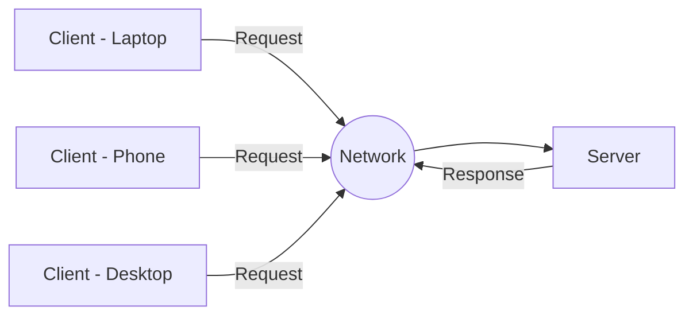
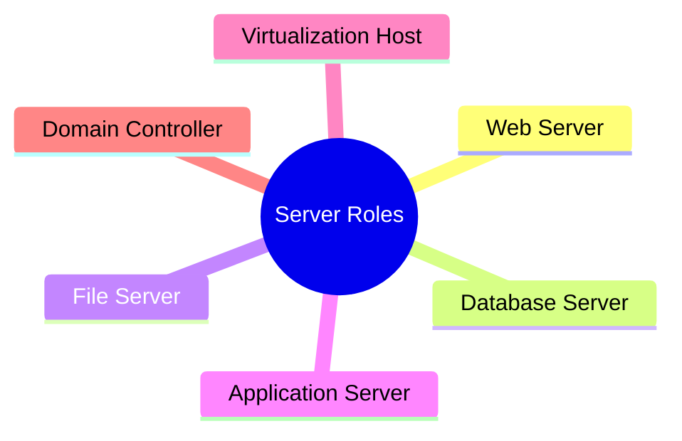
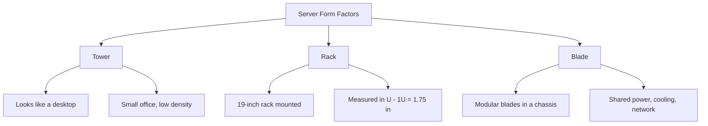
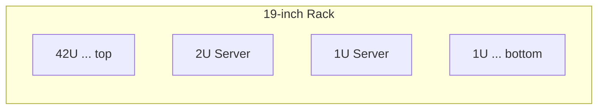
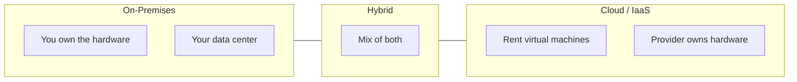

# Day 1 — Server Basics

> **Module Level:** Beginner &nbsp;|&nbsp; **Duration:** 1.5 hours &nbsp;|&nbsp; **Track:** Server Hardware Training

---

## At a Glance

| # | Topic | Time | Focus |
|---|---|---:|---|
| 1.1 | What Is a Server | 20 min | Concept & roles |
| 1.2 | Server Form Factors | 30 min | Tower / Rack / Blade |
| 1.3 | On-Prem vs Cloud Hardware View | 20 min | Where hardware lives |
| — | Hands-on Activity | 20 min | Identify & match |

**Objective:** Understand what a server is, how it differs from a desktop, and recognize the major physical form factors.

---

## Topic 1.1 — What Is a Server (20 min)

A **server** is a computer dedicated to providing services (compute, storage, applications) to other machines called **clients**, usually over a network. Unlike a desktop built for one interactive user, a server is built for **24x7 uptime, redundancy, remote management, and high I/O**.

### The Client-Server Model

### Server vs Desktop

| Attribute | Desktop | Server |
|---|---|---|
| Uptime | Working hours | 24x7 |
| Users | Single | Many (clients) |
| Memory | Standard | ECC (error-correcting) |
| Power supply | Single | Often redundant |
| Management | Local | Remote / out-of-band |

### Common Server Roles

> 📷 **Image placeholder:** `assets/server-hardware/day1-datacenter.jpg` — a photo of a real data center rack row.

---

## Topic 1.2 — Server Form Factors (30 min)

The three main physical formats. Each trades off **density, scalability, cost, and cooling**.

### Comparison

| Form Factor | Density | Scalability | Cost | Best For |
|---|---|---|---|---|
| **Tower** | Low | Low | Low | Small office, single server |
| **Rack** | Medium-High | High | Medium | Enterprise data centers |
| **Blade** | Very High | Very High | High upfront | High-density compute |

### Understanding Rack Units (U)

A rack is **19 inches** wide and measured vertically in **U**, where **1U = 1.75 inches**.

> 📷 **Image placeholder:** `assets/server-hardware/day1-formfactors.png` — side-by-side tower, rack, and blade photos.

---

## Topic 1.3 — On-Prem vs Cloud Hardware View (20 min)

Even in cloud-first teams, the same hardware concepts (CPU, RAM, storage, network) exist underneath the abstraction.

| Model | Who Owns Hardware | You Manage | Hardware Literacy Needed? |
|---|---|---|---|
| On-Prem | You | Everything | Yes |
| Cloud (IaaS) | Provider | OS & apps | Yes (it still maps to real hardware) |
| Hybrid | Both | Shared | Yes |

> **Key takeaway:** A cloud VM with "8 vCPU, 32 GB RAM, SSD" maps directly to the physical CPU, memory, and storage concepts covered in this course.

---

## Hands-on Activity (20 min)

1. **Identify the parts:** From sample diagrams/photos, label the server, client, network, and form factor.
2. **Match the scenario:** Assign the right form factor to each business case.

| Scenario | Best Form Factor? |
|---|---|
| Small accounting office, 1 server | _____ |
| Enterprise data center, hundreds of servers | _____ |
| High-density compute lab, minimal cabling | _____ |

> 📷 **Image placeholder:** `assets/server-hardware/day1-activity.png` — labeled diagram for the identification exercise.

---

## Day 1 Summary

- A **server** provides services to clients and is built for uptime, redundancy, and remote management.
- The three **form factors** are **tower** (small office), **rack** (enterprise standard, measured in U), and **blade** (high density, shared chassis).
- Hardware concepts apply **on-prem and in the cloud** — a cloud VM still maps to real CPU, RAM, storage, and network.

### Outcomes
- ✅ Explain what a server does and how it differs from a desktop.
- ✅ Identify tower, rack, and blade servers and when to use each.
- ✅ Understand that hardware literacy matters even in cloud environments.

### Quick Quiz
1. What is the main difference between a server and a desktop?
2. How many inches is 1U?
3. Which form factor offers the highest density?
4. Why is ECC memory used in servers?
5. Does a cloud VM eliminate the need to understand hardware? Why or why not?

---

## Image Guide (How to Add Photos)

This document uses **Mermaid diagrams** that render automatically in GitHub and VS Code (with the Markdown Preview Mermaid extension). For real photos, drop files into an `assets/server-hardware/` folder and the placeholders above will display them.

Suggested images to source:
- `day1-datacenter.jpg` — data center rack row
- `day1-formfactors.png` — tower vs rack vs blade
- `day1-activity.png` — labeled identification diagram

> **Next:** Day 2 — Core Components (CPU, RAM, motherboard, PSU, NIC, storage interfaces).

