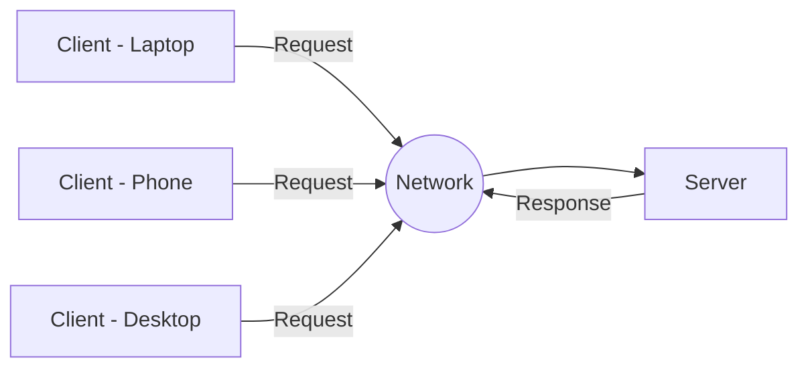
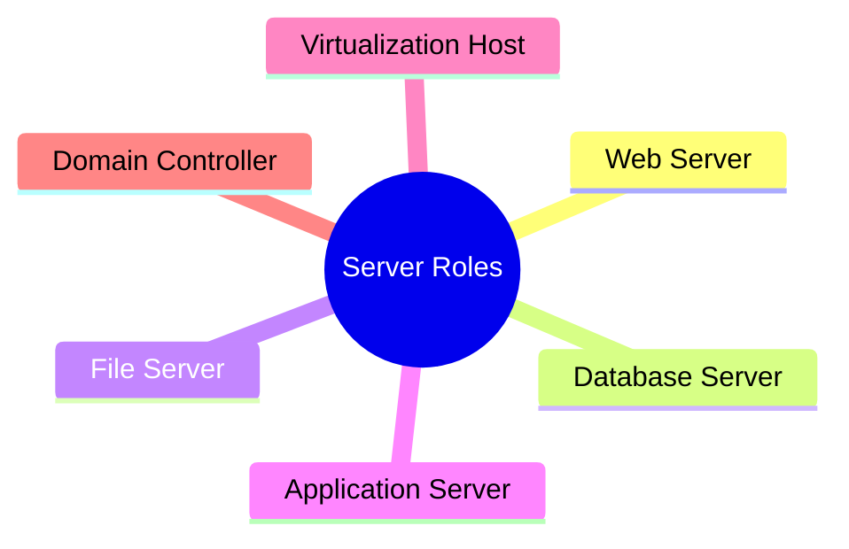
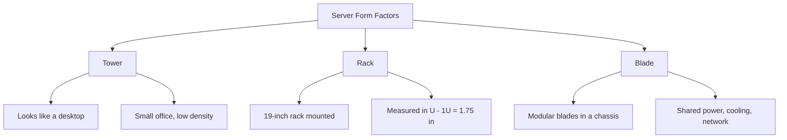
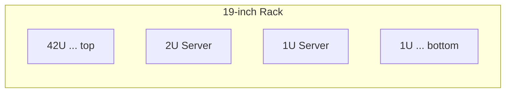

# Day 1 — Server Basics

> **Module Level:** Beginner | **Track:** Server Hardware Training

---

## At a Glance

| # | Topic | Focus |
|---|---|---|
| 1.1 | What Is a Server | Concept & roles |
| 1.2 | Server Form Factors | Tower / Rack / Blade |
| 1.3 | On-Prem vs Cloud Hardware View | Where hardware lives |
| 1.4 | Inside the Server: Hardware Components | Tour of internal parts |

**Objective:** Understand what a server is, how it differs from a desktop, and recognize the major physical form factors.

---

## Topic 1.1 — What Is a Server

A **server** is a computer dedicated to providing services (compute, storage, applications) to other machines called **clients**, usually over a network.

Unlike a desktop built for one interactive user, a server is built for:

- 24×7 uptime
- Redundancy
- Remote management
- High I/O

### The Client-Server Model

### Server vs Desktop

| Attribute | Desktop | Server |
|------------|----------|----------|
| Uptime | Working hours | 24x7 |
| Users | Single | Many (clients) |
| Memory | Standard | ECC (error-correcting) |
| Power Supply | Single | Often redundant |
| Management | Local | Remote / Out-of-band |

### Common Server Roles

> **Image placeholder:** `assets/server-hardware/day1-datacenter.jpg` — a photo of a real data center rack row.

---

## Topic 1.2 — Server Form Factors

The three main physical formats. Each trades off:

- Density
- Scalability
- Cost
- Cooling

### Comparison

| Form Factor | Density | Scalability | Cost | Best For |
|------------|----------|-------------|------|----------|
| **Tower** | Low | Low | Low | Small office, single server |
| **Rack** | Medium-High | High | Medium | Enterprise data centers |
| **Blade** | Very High | Very High | High upfront | High-density compute |

### Understanding Rack Units (U)

A rack is **19 inches** wide and measured vertically in **U**, where:

**1U = 1.75 inches**

> **Image placeholder:** `assets/server-hardware/day1-formfactors.png` — side-by-side tower, rack, and blade photos.
