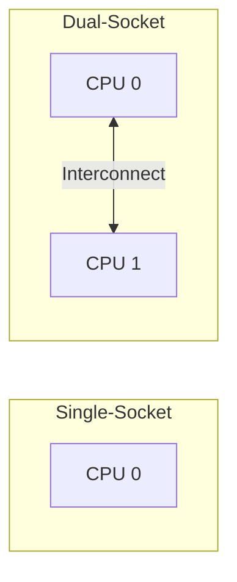
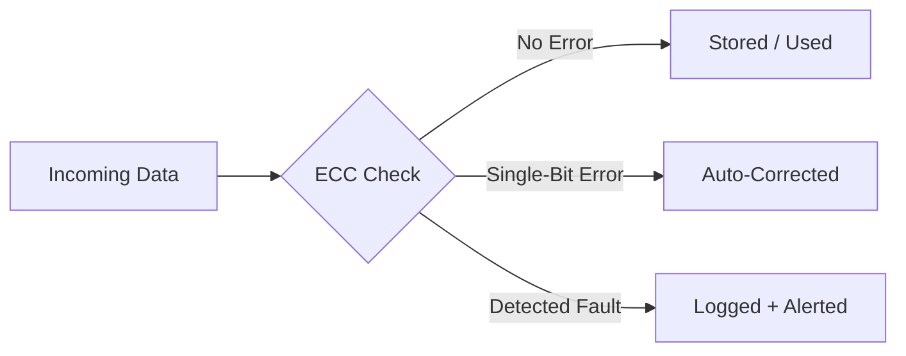
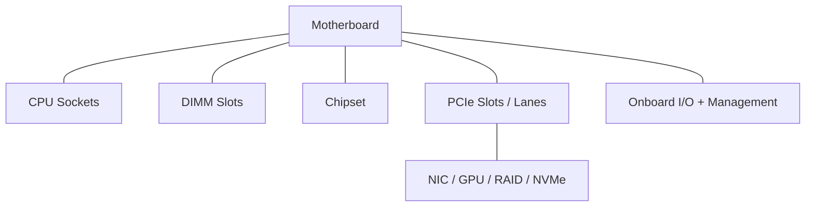
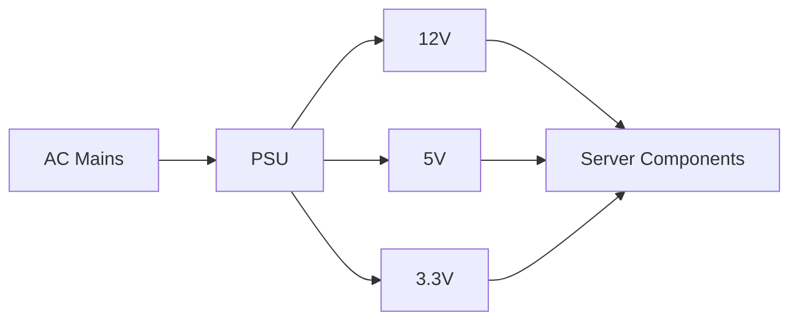
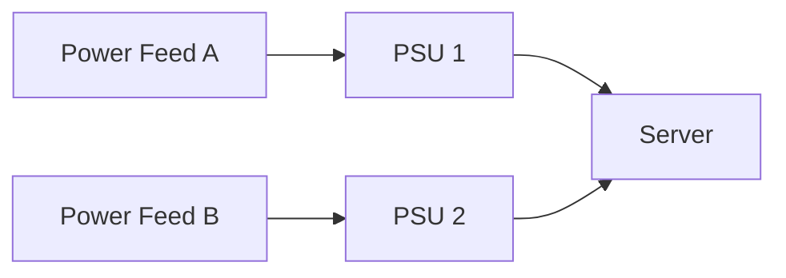

# Day 2 — Core Components

  
  
  

  <b>Goal:</b> Identify every major internal component and understand its purpose — CPU, memory, motherboard, power, and the network/storage interfaces that connect a server to the world.

---

## Topics in This Module

1. [CPU (Processor)](#21--cpu-processor)
2. [Memory (RAM)](#22--memory-ram)
3. [Motherboard, Chipset & Buses](#23--motherboard-chipset--buses)
4. [Power Supply Unit (PSU)](#24--power-supply-unit-psu)
5. [Network & Storage Interfaces](#25--network--storage-interfaces)

---

## 2.1 — CPU (Processor)

The **CPU (Central Processing Unit)** executes instructions — it is the "brain" of the server.

Server-class CPUs such as **Intel Xeon** and **AMD EPYC** are designed for:

* High core counts
* Large cache sizes
* ECC memory support
* Multi-socket configurations

### Key Concepts

| Term                  | Meaning                                                         |
| --------------------- | --------------------------------------------------------------- |
| **Core**              | An independent processing unit; more cores = more parallel work |
| **Thread**            | A logical execution stream; one core may run multiple threads   |
| **Clock Speed (GHz)** | Cycles per second; higher benefits single-threaded workloads    |
| **Cache (L1/L2/L3)**  | Small ultra-fast memory close to CPU cores                      |
| **Socket**            | Physical CPU mount; servers may have multiple sockets           |

### Single vs Multi-Socket

### Server CPU vs Desktop CPU

| Attribute            | Desktop CPU       | Server CPU      |
| -------------------- | ----------------- | --------------- |
| Core Count           | Lower             | Very High       |
| ECC Memory           | Often Unsupported | Supported       |
| Sockets              | 1                 | 1, 2, or More   |
| Reliability Features | Basic             | Extensive (RAS) |

> [!NOTE]
> More cores vs higher clock speed is a trade-off. Virtualization and database workloads favor more cores, while latency-sensitive workloads may benefit from higher clock speeds.

---

## 2.2 — Memory (RAM)

**RAM (Random Access Memory)** is fast, volatile storage used for active data and running applications.

Servers typically install memory using **DIMM** modules and almost always use **ECC memory**.

### Why ECC Matters

> [!IMPORTANT]
> ECC (Error-Correcting Code) memory automatically detects and corrects single-bit memory errors, reducing the risk of silent data corruption.

### DIMM Types

| Type       | Full Name         | Typical Use                         |
| ---------- | ----------------- | ----------------------------------- |
| **UDIMM**  | Unbuffered DIMM   | Entry-level servers / workstations  |
| **RDIMM**  | Registered DIMM   | Mainstream enterprise servers       |
| **LRDIMM** | Load-Reduced DIMM | High-capacity memory configurations |

### Specs to Know

* Capacity (16 GB, 32 GB, 64 GB, etc.)
* Speed (DDR4-3200, DDR5-4800, etc.)
* Memory channels for maximizing bandwidth

---

## 2.3 — Motherboard, Chipset & Buses

The **motherboard (mainboard)** ties every component together and defines the server's expansion limits.

### PCIe — The Expansion Backbone

* PCIe (Peripheral Component Interconnect Express) connects expansion cards.
* Measured in lanes (x1, x4, x8, x16).
* More lanes provide more bandwidth.
* Newer generations (Gen3 → Gen4 → Gen5) provide significantly more throughput.

| PCIe Use   | Example Card                  |
| ---------- | ----------------------------- |
| Networking | NIC (10/25/100 GbE)           |
| Compute    | GPU / AI Accelerator          |
| Storage    | RAID Controller, NVMe Adapter |

> [!TIP]
> Always verify both the slot count and lane allocation. A slot may be physically x16 but electrically wired as x8.

---

## 2.4 — Power Supply Unit (PSU)

The PSU converts incoming AC power into the DC voltages required by server components.

### Efficiency Ratings — 80 PLUS

| Rating   | Relative Efficiency |
| -------- | ------------------- |
| Bronze   | Good                |
| Silver   | Better              |
| Gold     | High                |
| Platinum | Very High           |
| Titanium | Highest             |

### Redundant Power (1+1)

> [!NOTE]
> With redundant PSUs (1+1), the server remains operational if one PSU or one power feed fails.

---

## 2.5 — Network & Storage Interfaces

These interfaces connect the server to networks and storage systems.

### Network Interface (NIC)

| Speed   | Common Use                 |
| ------- | -------------------------- |
| 1 GbE   | Management / Legacy        |
| 10 GbE  | Standard Server Networking |
| 25 GbE  | Modern Data Centers        |
| 100 GbE | High-Throughput Networks   |

* **Onboard NIC** – Built into the motherboard.
* **Add-in NIC** – Installed through PCIe slots.

### Storage Interfaces

| Interface | Tier        | Notes                              |
| --------- | ----------- | ---------------------------------- |
| SATA      | Entry-Level | Lower throughput                   |
| SAS       | Enterprise  | Higher reliability and queue depth |
| NVMe      | Performance | Lowest latency, PCIe-based         |

> [!IMPORTANT]
> Storage technologies will be covered in detail during Day 3 — Storage & RAID.

---

## Day 2 Summary

* CPUs provide compute resources through cores, threads, cache, and sockets.
* ECC memory protects against data corruption.
* Motherboards provide connectivity through PCIe lanes and onboard interfaces.
* PSUs convert AC to DC and can be deployed redundantly.
* NICs connect servers to networks.
* SATA, SAS, and NVMe provide different levels of storage performance.

### Outcomes

* Describe the function of CPU, RAM, motherboard, PSU, NIC, and storage interfaces.
* Explain the importance of ECC memory.
* Understand basic PCIe, memory, and power specifications.

---

## Knowledge Check

Click to reveal quick-quiz questions

1. What is the difference between a CPU core and a thread?
2. Why do servers use ECC memory?
3. What does PCIe x8 mean?
4. What are two benefits of redundant power supplies?
5. Rank SATA, SAS, and NVMe by performance.
6. When would you choose more CPU cores instead of a higher clock speed?

---

  <a href="#day-2--core-components">Back to top</a>
  &nbsp;•&nbsp;
  <b>Prev:</b> Day 1 — Server Basics
  &nbsp;•&nbsp;
  <b>Next:</b> Day 3 — Storage & RAID

